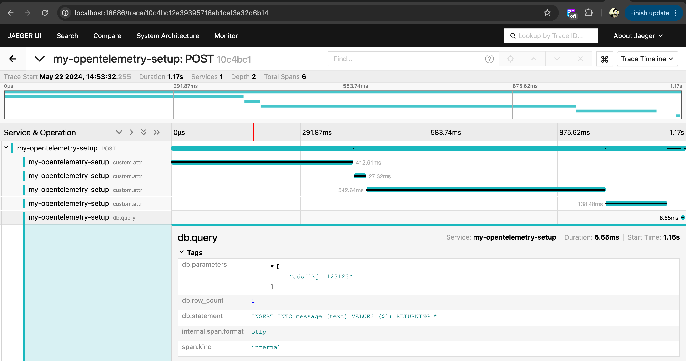

## Test OpenTelemetry tracing

- setup Jaeger to view spans as well

## Run infra

```bash
yarn infra:jaeger:up
# roll your own db (postgres)
```

## Run the application

```bash
# setup .env
# cp .env.example .env
# update db values
# create database
yarn migrate up
yarn dev
```

## Query

```bash
curl -X POST localhost:8080/ping-serial -H "Content-Type: application/json" -d '{"text":"hello world"}'
```

## View Spans

> http://localhost:16686/search?service=my-opentelemetry-setup

## Example


